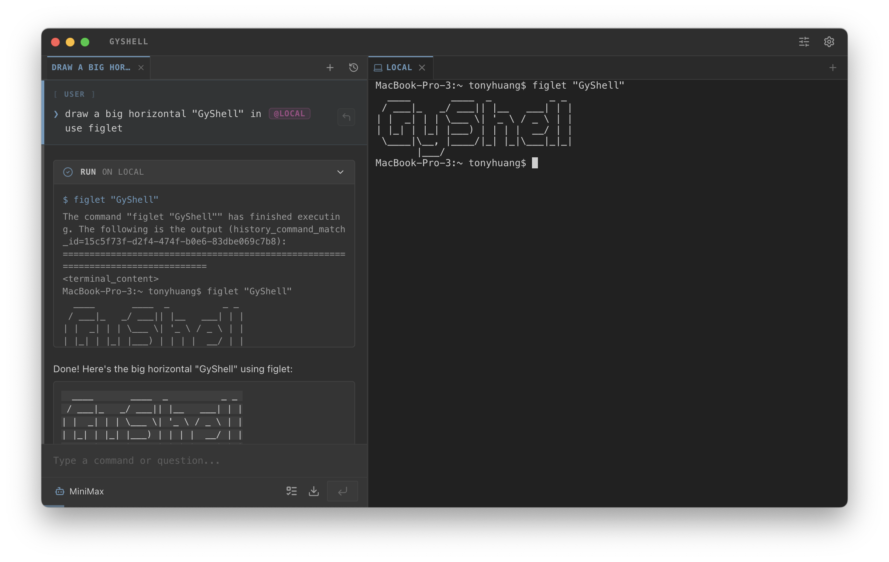

#  GyShell

> **The AI-Native Terminal that Thinks with You.**  
> **一款会和你并肩思考的 AI 原生终端。**

[](https://creativecommons.org/licenses/by-nc/4.0/)
[](#-multi-platform-desktop-app--多平台桌面应用)
[](#-comprehensive-shell-support--全方位-shell-支持)

---



[English](#english) | [中文](#chinese)

---

<a name="english"></a>

## 🌟 Why GyShell?

Unlike traditional AI assistants that merely generate scripts or execute one-off commands in a sandbox, **GyShell** provides a **Continuous, Human-Like Interaction** with your real-world shell environment.

### 🧠 Human-Like Interaction & Persistence
*   **Continuous Task Execution**: GyShell's Agent doesn't just "run and forget." It maintains a persistent state across the entire task lifecycle. It observes the output, reasons about the result, and decides the next move—just like a human developer.
*   **Real-Time Human Intervention**: You are always in control. You can watch the Agent type in real-time and intervene at any moment. The terminal remains fully interactive even while the Agent is working.
*   **Multi-Tab Mastery**: A single Agent can orchestrate tasks across **multiple terminal tabs** simultaneously. It can compile code in one tab, check logs in another, and deploy in a third, maintaining a global context of your entire workspace.
*   **Parallel Dialog Sessions**: Run multiple independent chat sessions at once. Each session can manage its own set of tabs. To ensure safety, GyShell implements a **Smart Locking Mechanism**—while an Agent is actively controlling a specific tab, that tab is "locked" to prevent command collisions.

### ⚡ Deep Shell Optimization
GyShell is built from the ground up to understand the nuances of terminal interaction:
*   **Intelligent Execution Modes**: The Agent automatically decides whether to **Wait** for a command to finish (for quick tasks like `ls` or `grep`) or run in **No-Wait (Async) Mode** (for long-running servers or interactive UIs).
*   **C0 Control Characters & Signals**: Beyond just text, the Agent can send raw **Control Characters** (such as `Ctrl+C`, `ESC`, or `Enter`) to manage interactive programs like `vim`, `top`, or to interrupt hanging processes.
*   **Clean History Integration**: GyShell tracks command status and environment changes seamlessly without injecting messy wrapper scripts into your terminal history.

---

## ✨ Key Features

### 🤖 AI-Native Intelligence
*   **Thinking Mode**: Before execution, the Agent enters a dedicated reasoning phase to analyze complex tasks, ensuring accuracy and safety.
*   **Context Awareness**: The AI "sees" your terminal output, understands your current working directory (CWD), and can even process files you've highlighted in the UI.
*   **Token Management**: Built-in intelligent pruning ensures your long conversations stay within model limits without losing critical context.
*   **Model Compatibility**: Supports any LLM that provides an **OpenAI-compatible API**. You can easily add your own models by providing an API Key and Base URL.

### 🌐 Professional Shell & SSH Client
*   **Comprehensive Shell Support**: Deeply integrated with **Zsh**, **Bash**, and **PowerShell**. It understands shell-specific behaviors and environments.
*   **Advanced SSH**: Supports password and private key authentication, SOCKS5/HTTP proxies, and complex port forwarding (Local, Remote, and Dynamic/SOCKS5 proxy).

### 🛠️ Powerful Toolset
*   **Queue Mode**: Chain multiple AI instructions into a queue. The Agent will execute them sequentially, perfect for long-running automation tasks.
*   **MCP (Model Context Protocol)**: Dynamically extend the Agent's capabilities by connecting to any MCP-compliant server.
*   **Skills**: Create reusable, markdown-based "Skills" that provide the Agent with specialized domain knowledge or SOPs.
*   **Smart File Editing**: The `create_or_edit` tool allows the AI to perform surgical string replacements instead of overwriting entire files.

### 🎨 Modern User Experience
*   **Flexible Layout**: Drag-and-drop to swap panels or resize your workspace to fit your workflow.
*   **Multi-Platform Desktop App**: 
    *   **macOS**: Fully supported and frequently tested (M-series ARM preferred).
    *   **Windows**: Supported with basic testing (x64).
*   **Rich Media Support**: The AI can read and analyze **PDFs** and **Images** directly from your terminal environment.

---

<a name="chinese"></a>

## 🌟 为什么选择 GyShell？

不同于那些仅能在沙盒中生成脚本或执行一次性命令的传统 AI 助手，**GyShell** 提供了与真实 Shell 环境的**持续性、类人化交互**。

### 🧠 类人交互与任务持续性
*   **持续性任务执行**：GyShell 的 Agent 并非“运行即结束”。它在整个任务生命周期内保持持久状态，观察输出、分析结果并决定下一步行动——就像一位真正的开发者在操作一样。
*   **实时人工介入**：你始终拥有最高控制权。你可以实时观察 Agent 的输入过程，并随时介入操作。即使 Agent 正在工作，终端也保持完全的交互能力。
*   **多标签页统筹**：单个 Agent 可以同时操控**多个终端标签页**。它可以在一个标签页编译代码，在另一个查看日志，并在第三个进行部署，同时掌握整个工作区的全局上下文。
*   **多对话并行**：支持同时运行多个独立的对话会话。每个会话可以管理自己的标签页集群。为了确保安全，GyShell 引入了**智能锁机制**——当一个 Agent 正在操控某个特定标签页时，该标签页会被锁定，防止指令冲突。

### ⚡ 深度 Shell 交互优化
GyShell 针对终端交互的细微差别进行了底层优化：
*   **智能执行模式**：Agent 会自动判断是**等待执行完成**（适用于 `ls`、`grep` 等快速任务），还是以**不等待（异步）模式**运行（适用于启动服务器或交互式 UI）。
*   **C0 控制字符与信号**：除了发送文本，Agent 还能发送原始的 **C0 控制字符**（如 `Ctrl+C`、`ESC` 或 `Enter`），从而精准操控 `vim`、`top` 等交互式程序，或中断卡死的进程。
*   **纯净的历史记录集成**：GyShell 能够无缝追踪指令状态和路径切换，而无需在您的终端历史中注入杂乱的包装脚本。

---

## ✨ 核心功能

### 🤖 AI 原生智能
*   **思考模式 (Thinking Mode)**：在执行任务前，Agent 会进入专门的推理阶段，分析复杂任务，确保执行的准确性与安全性。
*   **上下文感知**：AI 能“看见”您的终端输出，理解当前工作目录（CWD），甚至能处理您在 UI 中选中的高亮内容。
*   **Token 管理**：内置智能剪裁机制，确保长对话在模型限制内运行，同时不丢失关键上下文。
*   **模型兼容性**：支持所有提供 **OpenAI 兼容接口** 的大语言模型。您可以通过提供 API Key 和 Base URL 轻松添加自定义模型。

### 🌐 专业级 Shell 与 SSH
*   **全方位 Shell 支持**：深度集成 **Zsh**、**Bash** 和 **PowerShell**。能够识别不同 Shell 的特性与环境变量。
*   **高级 SSH 功能**：支持密码和私钥认证、SOCKS5/HTTP 代理，以及复杂的端口转发（本地、远程及动态 SOCKS5 代理）。

### 🛠️ 强大的工具链
*   **队列模式 (Queue Mode)**：将多个 AI 指令串联进队列。Agent 将按序自动执行，非常适合长时间运行的自动化任务。
*   **MCP (模型上下文协议)**：通过连接任何符合 MCP 规范的服务器，动态扩展 Agent 的能力。
*   **技能系统 (Skills)**：创建基于 Markdown 的可重用“技能”，为 Agent 提供专门的领域知识或标准作业程序（SOP）。
*   **智能文件编辑**：`create_or_edit` 工具允许 AI 进行精准的字符串替换，而非简单地覆盖整个文件。

### 🎨 现代化的用户体验
*   **灵活布局**：支持拖拽交换面板位置或调整大小，随心定制您的工作流。
*   **多平台桌面应用**：
    *   **macOS**: 深度支持，经过频繁且严苛的测试（推荐 M 系列芯片）。
    *   **Windows**: 支持运行，经过少量基础测试 (x64)。
*   **多模态支持**：AI 可以直接读取并分析终端环境中的 **PDF** 和 **图片**。

---

## 📦 Installation & Build / 安装与构建

### Prerequisites / 前置要求
- Node.js (v18+)
- npm

### Steps / 步骤
1.  **Clone the repository / 克隆仓库**
    ```bash
    git clone https://github.com/MrOrangeJJ/GyShell.git
    cd GyShell
    ```
2.  **Install dependencies / 安装命令**
    ```bash
    npm install
    ```
3.  **Development / 开发模式启动**
    ```bash
    npm run dev
    ```
4.  **Production Build / 构建生产环境应用**
    - **macOS**: `npm run dist:mac`
    - **Windows**: `npm run dist:win`

---

## 📄 License / 开源协议
This project is licensed under the **Creative Commons Attribution-NonCommercial 4.0 International (CC BY-NC 4.0)**. 
You are free to share and adapt the material, but you **must** give appropriate credit and you **may not** use the material for commercial purposes.

本项目采用 **知识共享署名-非商业性使用 4.0 国际许可协议 (CC BY-NC 4.0)**。
您可以自由地分享和修改本项目，但**必须**给出适当的署名，且**不得**将本项目用于商业目的。

---

## 🛠️ Tech Stack / 技术栈
- **Framework**: Electron, Vite, React
- **State Management**: MobX
- **Terminal**: xterm.js, node-pty, ssh2
- **AI Orchestration**: LangGraph, LangChain
- **Styling**: Sass

---

**GyShell** - *The shell that thinks with you.* / *会和你一起思考的终端。*
