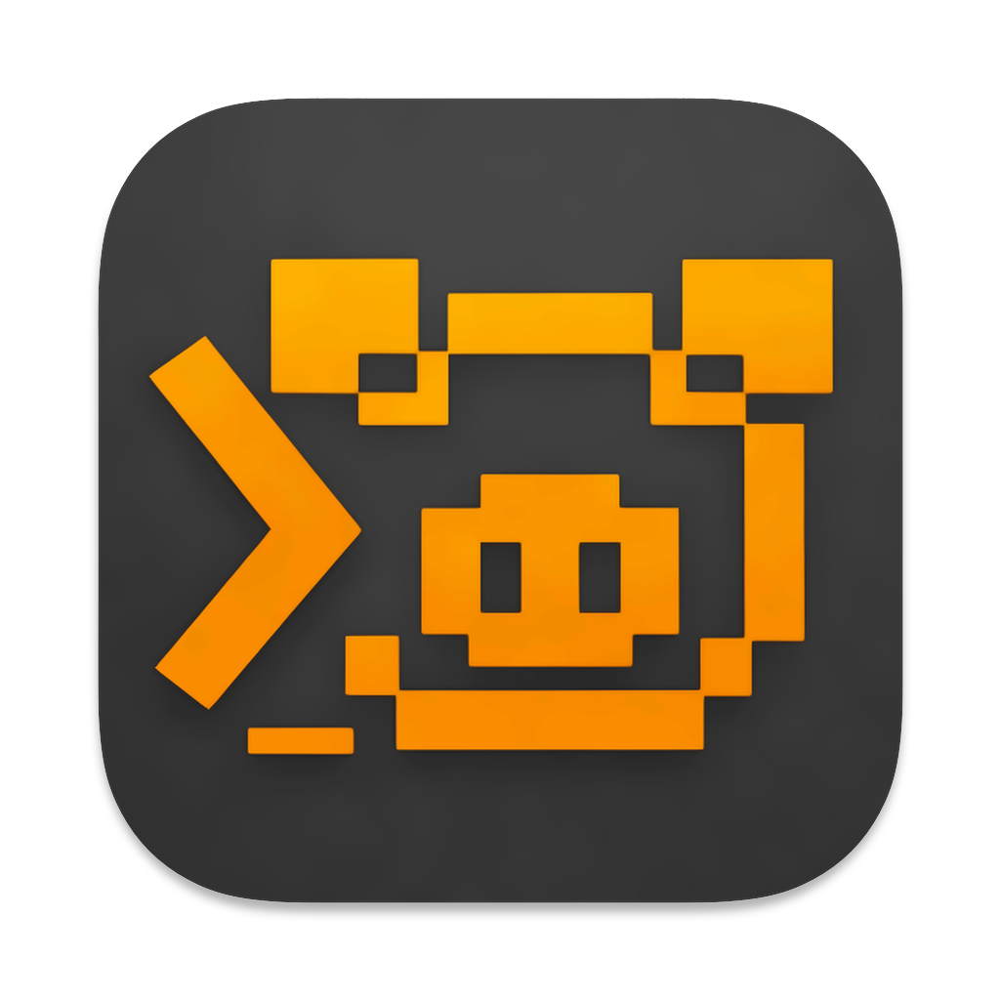

#  GyShell

> **v0.1.5 has been released! [Check out here](./changelogs/v0.1.5.md)**

> **The AI-Native Terminal that Thinks with You.**  

[](https://creativecommons.org/licenses/by-nc/4.0/)
[](#-multi-platform-desktop-app--多平台桌面应用)
[](#-comprehensive-shell-support--全方位-shell-支持)

> [!WARNING]
> **Active Development Phase**: This project is in a high-speed development stage. Compatibility of chat history data between versions is not guaranteed. If significant breaking changes occur, they will be clearly marked in the Release notes with a major version jump. Currently, versions remain compatible.

<p align="center">
  
</p>

---

GyShell Demo

[English](#english) | [中文](#chinese)

---

## 🌟 Why GyShell?

Unlike traditional AI assistants that merely generate scripts or execute one-off commands in a sandbox, **GyShell** provides a **Continuous, Human-Like Interaction** with your real-world shell environment.

### 🧠 Human-Like Interaction & Persistence

- **Continuous Task Execution**: GyShell's Agent maintains a persistent state across the entire task lifecycle. It observes the output, reasons about the result, and decides the next move—just like a human developer.
- **Real-Time Human Intervention**: You are always in control. You can watch the Agent type in real-time and intervene at any moment. The terminal remains fully interactive even while the Agent is working.
- **Multi-Tab Mastery**: A single Agent can orchestrate tasks across **multiple terminal tabs** simultaneously. It can compile code in one tab, check logs in another, and deploy in a third.
- **Smart Context Mentions**: Use **@mentions** to instantly provide the Agent with the context of specific terminal tabs, skills, or files.
- **Brand New CLI UI**: An immersive command-line style interface designed for developers, seamlessly blending AI collaboration with terminal operations.

### ⚡ Deep Shell Optimization

GyShell is built from the ground up to understand the nuances of terminal interaction:

- **Intelligent Execution Modes**: The Agent automatically decides whether to **Wait** for a command to finish or run in **No-Wait (Async) Mode** (for servers or interactive UIs).
- **Terminal Idle Detection**: The `wait_terminal_idle` tool allows the Agent to wait for terminal output to stabilize before proceeding, perfect for long-running installations.
- **Enhanced Execution Control**: Support for manually **Skipping** steps during execution, with a unified status feedback protocol.
- **C0 Control Characters & Signals**: Beyond just text, the Agent can send raw **Control Characters** (such as `Ctrl+C`, `ESC`, or `Enter`) to manage interactive programs like `vim` or `top`.
- **Clean History Integration**: GyShell tracks command status and environment changes seamlessly without injecting messy wrapper scripts.

---

## ✨ Key Features

### 🤖 AI-Native Intelligence

- **Thinking Mode**: Before execution, the Agent enters a dedicated reasoning phase to analyze complex tasks, ensuring accuracy and safety.
- **Context Awareness**: The AI "sees" your terminal output, understands your CWD, and can even process files you've highlighted in the UI.
- **Token Management**: Built-in intelligent pruning ensures your long conversations stay within model limits without losing critical context.
- **Model Compatibility**: Supports any LLM that provides an **OpenAI-compatible API**.
- **GitHub-Only Version Check**: Built-in Version settings page with manual "Check Updates", startup auto-check, and update dialog. The app checks only this repository's `version.json` on GitHub (with ETag cache), with no third-party update endpoint.

### 🌐 Professional Shell & SSH Client

- **Comprehensive Shell Support**: Deeply integrated with **Zsh**, **Bash**, and **PowerShell**.
- **Advanced SSH**: Supports password/private key auth, SOCKS5/HTTP proxies, and **Bastion Host (Jump Server)** support.
- **Port Forwarding**: Complex forwarding support (Local, Remote, and Dynamic/SOCKS5).

### 🛠️ Powerful Toolset

- **Advanced Skills**: Supports the **agentskills.io** specification. Create reusable, folder-based "Skills" that include supporting scripts and SOPs.
- **MCP (Model Context Protocol)**: Dynamically extend the Agent's capabilities by connecting to any MCP-compliant server.
- **Smart File Editing**: The `create_or_edit` tool allows the AI to perform surgical string replacements instead of overwriting entire files.

---

## 🌟 为什么选择 GyShell？

不同于那些仅能在沙盒中生成脚本或执行一次性命令的传统 AI 助手，**GyShell** 提供了与真实 Shell 环境的**持续性、类人化交互**。

### 🧠 类人交互与任务持续性

- **持续性任务执行**：GyShell 的 Agent 在整个任务生命周期内保持持久状态，观察输出、分析结果并决定下一步行动——就像一位真正的开发者在操作一样。
- **实时人工介入**：你始终拥有最高控制权。你可以实时观察 Agent 的输入过程，并随时介入操作。即使 Agent 正在工作，终端也保持完全的交互能力。
- **多标签页统筹**：单个 Agent 可以同时操控**多个终端标签页**。它可以在一个标签页编译代码，在另一个查看日志，并在第三个进行部署。
- **智能上下文提及**：通过 **@提及 (@mentions)** 快速为 Agent 提供特定标签页、技能或文件的上下文信息。
- **全新 CLI 风格 UI**：专为开发者设计的沉浸式命令行风格界面，让 AI 协作与终端操作无缝融合。

### ⚡ 深度 Shell 交互优化

GyShell 针对终端交互的细微差别进行了底层优化：

- **智能执行模式**：Agent 会自动判断是**等待执行完成**，还是以**不等待（异步）模式**运行（适用于启动服务器或交互式 UI）。
- **终端空闲检测**：新增 `wait_terminal_idle` 工具，允许 Agent 自动等待终端输出稳定后再继续，完美处理长时间安装或编译任务。
- **执行控制增强**：支持在任务执行过程中手动**跳过 (Skip)** 特定步骤，并统一了任务状态反馈协议。
- **C0 控制字符与信号**：除了发送文本，Agent 还能发送原始的 **C0 控制字符**（如 `Ctrl+C`、`ESC` 或 `Enter`），从而精准操控 `vim`、`top` 等交互式程序。
- **纯净的历史记录集成**：无缝追踪指令状态 and 路径切换，无需在您的终端历史中注入杂乱的包装脚本。

---

## ✨ 核心功能

### 🤖 AI 原生智能

- **思考模式 (Thinking Mode)**：在执行任务前进入专门的推理阶段，分析复杂任务，确保执行的准确性与安全性。
- **上下文感知**：AI 能“看见”您的终端输出，理解当前工作目录（CWD），并支持通过 **@提及** 引用资源。
- **Token 管理**：内置智能剪裁机制，确保长对话在模型限制内运行，同时不丢失关键上下文。
- **模型兼容性**：支持所有提供 **OpenAI 兼容接口** 的大语言模型。
- **仅 GitHub 的版本检查**：内置 Version 设置页，支持手动“检查更新”、启动自动检查与更新提示弹窗。应用只会请求本仓库 GitHub 上的 `version.json`（含 ETag 缓存），不使用任何第三方更新接口。

### 🌐 专业级 Shell 与 SSH

- **全方位 Shell 支持**：深度集成 **Zsh**、**Bash** 和 **PowerShell**。
- **高级 SSH 功能**：支持密码/私钥认证、代理，以及新增的**堡垒机（跳板机）**支持。
- **端口转发**：支持本地、远程及动态 SOCKS5 代理转发。

### 🛠️ 强大的工具链

- **增强型技能系统 (Skills)**：支持 **agentskills.io** 规范。支持带配套资源的文件夹式“技能”，为 Agent 提供专门的领域知识或 SOP。
- **MCP (模型上下文协议)**：通过连接 MCP 服务器动态扩展 Agent 能力。
- **智能文件编辑**：`create_or_edit` 工具允许 AI 进行精准的字符串替换，而非简单地覆盖整个文件。

---

## 📦 Installation & Build / 安装与构建

### Prerequisites / 前置要求

- Node.js (v18+)
- npm

### Steps / 步骤

1. **Clone the repository / 克隆仓库**
  ```bash
    git clone https://github.com/MrOrangeJJ/GyShell.git
    cd GyShell
  ```
2. **Install dependencies / 安装命令**
  ```bash
    npm install
  ```
3. **Development / 开发模式启动**
  ```bash
    npm run dev
  ```
4. **Production Build / 构建生产环境应用**
  - **macOS**: `npm run dist:mac`
    - **Windows**: `npm run dist:win`

---

## 📄 License

This project is licensed under the **Creative Commons Attribution-NonCommercial 4.0 International (CC BY-NC 4.0)**. 

### Special Acknowledgments

This project uses code references and inspiration from [Tabby](https://github.com/Eugeny/tabby) (MIT License).

---

## 🛠️ Tech Stack

- **Framework**: Electron, Vite, React
- **State Management**: MobX
- **Terminal**: xterm.js, node-pty, ssh2
- **AI Orchestration**: LangGraph, LangChain
- **Styling**: Sass

---

**GyShell** - *The shell that thinks with you.* / *会和你一起思考的终端。*
