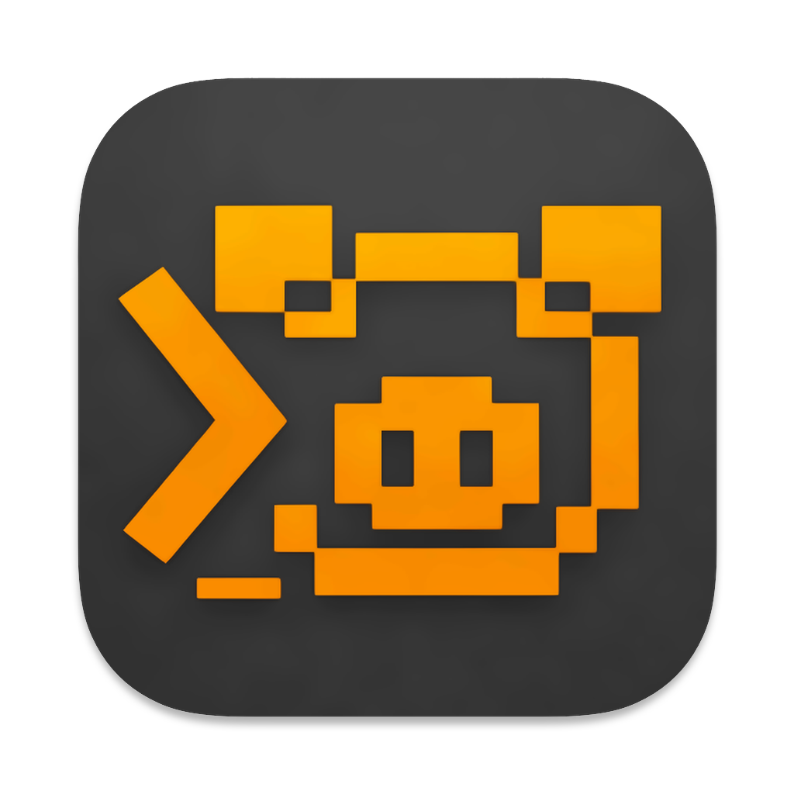

#  GyShell

> **会思考、会执行、可协作的 AI 原生终端。**

[](https://creativecommons.org/licenses/by-nc/4.0/)
[](#支持平台)
[](#核心能力)

[English README](./README.md) | 中文 README  
最新发布说明：[`changelogs/v1.6.0.md`](./changelogs/v1.6.0.md)

如果有任何建议或者问题，欢迎在 [GitHub Discussions](https://github.com/MrOrangeJJ/GyShell/discussions) 中提交。

使用教程:
[`docs/cli-usage.md`](./docs/cli-usage.md) ·
[`docs/mobile-web-usage.md`](./docs/mobile-web-usage.md) ·
[`docs/tui-usage.md`](./docs/tui-usage.md) ·
[`docs/gybackend-usage.md`](./docs/gybackend-usage.md)

> [!WARNING]
> **项目处于快速迭代阶段**：如果某个版本引入了历史数据兼容性变更，会在发布说明中明确标注。

> [!NOTE]
> **v1.4.0 升级提示**：从 1.4.0 以下版本升级后的首次启动可能会短暂阻塞，因为 GyShell 会把旧的 JSON 历史迁移到 SQLite，并写入带时间戳的备份文件。v1.4.3 无需额外迁移步骤。

<p align="center">
  
</p>
<p align="center">
  
</p>
<p align="center">
  <video controls width="100%" src="https://github.com/user-attachments/assets/f9daf884-bda0-4a58-8a6d-934db0eddeb5"></video>
</p>

---

## GyShell 的差异化价值

很多 AI 终端工具要么一次性给脚本，要么跑在与真实工作流脱节的隔离沙盒里。

GyShell 的定位是“运行在真实终端中的持续执行系统”：

- **持续执行闭环**：读取输出 -> 判断状态 -> 继续推进。
- **天然可干预**：你可以随时接管，不打断工作流。
- **多标签并行调度**：编译、看日志、修复可跨标签协同。
- **全局 Tab 清单**：通过专门的列表面板扫描、恢复、拖动、关闭和创建 terminal/chat tab。
- **工作区可恢复**：terminal tab、面板布局和已保存布局槽位可跨重启恢复，快速续作。
- **可拆分的多窗口工作区**：面板可独立成子窗口，标签和整块面板都能跨窗口移动。
- **自适应的面板标签显示**：窄 header 下可切成紧凑选择器，宽空间下保留完整标签栏。
- **可复用的 Agent Setting 配置档**：保存并重新应用模型、工具、策略、memory 和 workflow flags 组成的完整运行配置。
- **集成文件管理**：可视化文件浏览、编辑、跨本地/SSH 会话传输，无需离开工作区。
- **实时资源可视化**：本地与 SSH 会话都可直接查看 CPU、内存、磁盘、网络、进程、套接字、GPU 等信息。
- **OpenClawd 风格远程对话控制**：核心运行在你自己的电脑上，你可以在任何地方通过对话持续控制。
- **桌面端内置 Mobile Web 发布能力**：可直接在桌面设置中对局域网发布移动端页面并复制访问链接。
- **多端同语义**：桌面端、纯命令 CLI、Mobile Web 共用统一网关模型。
- **Profile Lock 安全性**：会话繁忙期间锁定模型配置，保证行为一致。
- **长上下文质量保障**：`memory.md` + 智能压缩摘要 + 可见边界 + 确定性兜底恢复让长会话依然清晰可控。
- **工具能力原生化**：Skills、MCP、内置工具是运行时一等能力。

### 一屏速览

- **面向真实交付**：不仅“给方案”，还能持续执行和纠偏。
- **面向长流程任务**：会话状态连续，不是一次性问答。
- **面向真实基础设施**：Shell、SSH、端口转发、文件管理、多标签交互式终端控制。
- **面向多设备与 agent 协作**：桌面端 + 纯命令 CLI + Mobile Web 共用网关语义。
- **面向多模态执行**：单轮里可组合文字与图片输入，直接推进真实任务。

## v1.6.0 关键亮点

- **全局 Tab List 面板**
  - 新增 `TAB LIST` 面板，用垂直清单展示 terminal 和 chat tab，包含数量、状态点、按最近更新时间排序、拖拽、关闭，以及快速创建 chat、本地 terminal、已保存 SSH terminal
- **默认工作区布局更新**
  - 新的主布局默认左侧为列表面板，中间为聊天，右侧为终端，让多 tab 工作区一打开就更容易扫描
- **更可预测的后台 terminal tab**
  - 从列表面板创建的本地和 SSH tab 都可以在后台启动，继续出现在全局 terminal 清单中，按需绑定到 terminal panel，并且不会意外切换关联的文件系统或监控 panel
- **可见的上下文压缩边界**
  - 长对话现在会在真实保留历史切点持久化并渲染 `[CTX COMPACTED]` 标记，桌面端、mobile-web 和 TUI 保持一致
- **确定性压缩兜底**
  - 当 compaction 模型失败或返回空摘要时，GyShell 可以用本地确定性 digest 恢复，保留受保护尾部，并在可用时导出更早的精确历史供按需查看
- **更稳的模型空流恢复**
  - 空内容、非工具调用的 provider stream 结束会进入正常重试路径，不再静默结束；有效的空工具调用结束仍会继续路由执行
- **终端清单稳定性**
  - terminal 标题在重复 backend snapshot、并发创建、用户显式数字后缀和 detached-window 转移场景下都保持唯一且稳定
- **内置 Mobile Web 产物刷新**
  - Electron 打包内置的 mobile-web 产物已重新生成，因此桌面构建直接托管的移动端页面会包含本次更新

---

## 核心能力

### AI 原生运行时

- 面向复杂任务的思考式执行流程。
- 基于终端上下文和选中资源的上下文感知。
- 支持按 Profile 分配 `Global`、`Thinking`、`Action`、`Compaction` 四类模型角色。
- 支持可复用 Agent Setting 配置档，保存模型 Profile、安全策略、工具、Skills、memory、递归和实验 workflow flags。
- 长会话智能压缩、独立压缩模型链路、可见的 `[CTX COMPACTED]` 压缩边界标记，以及模型压缩不可用时的确定性兜底恢复。
- 会话与 UI 历史改为基于 SQLite 持久化，并支持从旧 JSON 存储自动做一次迁移。
- 支持基于当前 tab 最近上下文生成命令草稿，并保留”先粘贴、再由你决定是否执行”的控制权。
- 后台（nowait）命令完成后会自动通知 Agent，无需轮询即可形成异步闭环。
- 对话面板支持 `传统模式` 与 `无感模式` 两种 Agent 活动呈现方式。
- 支持通过 `memory.md` 注入持久记忆；当应用 Agent Setting 配置档时，memory 会按活跃配置档隔离。
- 支持多模态输入链路（文字 + 图片）。
- 支持 OpenAI 兼容接口模型，并能在遇到"空的畸形工具调用结束"流时自动恢复。
- 提供可选的试验性 Agent 工具，包括在终端 tab 之间进行异步跨机器文件传输并轮询进度。

### 终端、SSH 与文件管理

- 原生支持 Zsh、Bash、PowerShell。
- 较旧的 Windows PowerShell 环境在本地与 SSH 场景下都会使用更稳的 sidecar 命令完成跟踪。
- SSH 支持密码/密钥认证、代理链路、堡垒机场景。
- 端口转发支持 Local / Remote / Dynamic SOCKS。
- Agent 可在单个任务中同时协调**多个 SSH/本地 terminal tab**。
- 支持控制字符，便于操控交互式终端程序。
- 可基于当前终端最近可见输出生成命令草稿，再粘回当前 tab，不会自动执行。
- 支持直接在当前终端缓冲区内搜索，不必离开 panel。
- 支持 terminal tab 跨后端重启恢复，并在同一后端运行期内为终端视图重挂载/重连提供输出无损补齐。
- 本地 terminal tab 在 shell 退出时会自动重新拉起 shell，让本地 tab 保持可用而不"假死"。
- 已断开的 SSH tab 可从 tab 右键菜单用其保存的连接配置在原地重新连接。
- **集成文件浏览面板**：可在本地与 SSH 会话中浏览、创建、重命名、删除、预览、排序、筛选和搜索文件。
- **跨会话文件传输**（复制/移动），实时进度展示、单任务取消、自适应 SFTP 传输调优。
- **内置文件编辑器面板**：直接在工作区内编辑、刷新、搜索和保存文本文件，并支持图片（`png/jpg/gif/webp/bmp/ico/svg/avif`）与 PDF（含翻页与缩放）的内联预览。
- **文件行右键菜单**：包含复制 / 剪切 / 粘贴 / 重命名 / 删除等操作，并支持 **复制完整路径**（多选时复制多条）到系统剪贴板。
- **粘贴冲突处理**：粘贴到含同名项的目录时，可在 **覆盖** 与 **保留两者**（自动添加数字后缀）之间选择。

### 工作区与监控

- 面板可拆到独立子窗口，标签和整块面板都能跨窗口移动。
- 可通过全局 Tab List 面板扫描 terminal/chat 清单、恢复未托管 tab、跨布局目标拖动 tab、关闭 tab，并创建新的 chat、本地 terminal 或 SSH tab，且不会强制打开 terminal panel。
- 可保存最多 3 个工作区布局槽位，并从 Rail 快速恢复。
- 可选在任意对话会话运行期间保持电脑唤醒，运行结束后自动解除系统睡眠阻止。
- 聊天 tab 会在会话繁忙时显示运行中指示器，与终端 tab 的运行状态圆点一致。
- 可按空间在 `自动`、`展开`、`Select` 三种 panel tab 显示模式之间切换。
- `Ctrl/Cmd+F` 可在终端、当前对话、文件浏览器、文件编辑器中打开统一的 panel 内搜索条。
- 可从工作区 Rail 直接打开资源监控面板，覆盖本地与 SSH 终端。
- 监控面板可展示 CPU、内存、磁盘、网络、进程、套接字，以及可用时的 GPU 信息。
- 指向同一台本机或同一 SSH 目标的标签页可共享监控采样，原始采样标签页退出时也能自动切换。
- 资源监控现在支持按本机/SSH 来源分别暂停或恢复，并保留该偏好设置。
- 紧凑监控布局下，GPU 拥有独立卡片，并能显示更清晰的显存占用信息。

### Skills + MCP + Tools

- 支持文件夹式 Skills 组织与复用。
- MCP 服务器可动态接入与管理。
- 提供精细化文件编辑能力，减少粗暴覆盖。
- 工具启用状态可被各客户端实时读取与控制。

### Mobile Web 伴随端

- 面向手机浏览器的远程会话伴随与控制体验。
- 桌面端可直接托管 Mobile Web，并在设置中复制访问链接。
- 支持 OpenClawd 风格的对话式远程操控（核心运行在你的电脑上）。
- 会话列表支持搜索和运行状态提示。
- 支持待审批 badge 与跳转到阻塞会话，并在任务完成时显示 toast。
- 支持在移动端执行对话回滚与从消息分支。
- 会话列表支持左滑删除，移动端清理更高效。
- 支持只读终端输出尾部、未读输出提示、本地/已保存 SSH terminal 创建，以及 SSH 重连。
- 可在移动端查看单轮详细事件链路。
- 通过网关 RPC 统一访问工具、技能、Agent Setting Profiles、终端和设置能力。
- 网关暴露范围支持仅本机、仅局域网、自定义 CIDR 范围和全部网卡。

---

## 支持平台

1. **Electron 桌面端**（`apps/electron`）
2. **独立后端运行时**（`apps/gybackend`）
3. **已废弃的 TUI 运行时**（`apps/tui` + `packages/tui`）
4. **Mobile Web 运行时**（`apps/mobile-web` + `packages/mobile-web`）
5. **面向 agent 的纯命令 CLI**（`apps/cli` + `packages/cli`）

### 怎么选入口？

- **桌面端**：主力全功能体验，适合日常开发。
- **纯命令 CLI（`gyll`）**：面向 agent 的单次 JSON 命令；没有 TUI，也不会交互式询问。
- **历史 TUI**：已废弃且不再提供支持。桌面安装包不再内置它。
- **Mobile Web**：OpenClawd 风格远程对话控制，适合随时随地接管活跃会话。

---

## 快速开始

### 前置要求

- Node.js 18+
- npm

### 本地开发

```bash
git clone https://github.com/MrOrangeJJ/GyShell.git
cd GyShell
npm install
npm run dev
```

### 一句话理解 GyShell

`GyShell = 持续 AI 运行时 + 真实终端控制 + 随时人工接管。`

### Mobile Web 开发

```bash
npm run dev:mobile-web
```

---

## 纯命令 CLI（`gyll`）

新的 `gyll` 是面向其他 agent 的轻量纯命令 gateway 客户端。它通过稳定 JSON 输出覆盖常见的对话/会话、审批、终端、profile、skill、tool、memory 与 policy 操作。

```bash
npm run build:cli
npm --silent run cli -- status
npm --silent run cli -- session list
npm --silent run cli -- chat send --message "运行测试并总结" --wait
```

旧交互式 TUI 仍然处于废弃状态。桌面安装包不会内置或自动安装任何 CLI，也不会修改 shell profile。详见 [`docs/cli-usage.md`](./docs/cli-usage.md)。

---

## 架构说明（简版）

GyShell 采用严格分层：

- `packages/*`：承载实现逻辑。
- `apps/*`：仅承载组合、启动、构建壳层。
- 前端实现代码不放入 `packages/backend`。

核心运行链路（简化）：

1. `startElectronMain`（桌面组合入口）
2. `GatewayService`（会话运行时与跨传输编排）
3. `WebSocketGatewayControlService`（访问策略控制）
4. `WebSocketGatewayAdapter` / `ElectronWindowTransport`（传输层实现）
5. 纯命令 CLI 与 Mobile Web 客户端控制器（以及已废弃的历史 TUI）

详见：

- `docs/monorepo-architecture.md`
- `docs/build-commands.md`

## 隐私与更新策略

- 版本检查只请求本项目 GitHub 仓库中的 `version.json`。
- 不使用第三方自动更新接口。
- 版本检查是应用自动后台网络请求中的唯一来源。

## 延伸阅读

- 发布说明：`changelogs/v1.6.0.md`
- 构建与打包命令矩阵：`docs/build-commands.md`
- Monorepo 边界与运行链路：`docs/monorepo-architecture.md`

---

## 构建与打包

- `npm run build`
- `npm run build:backend`
- `npm run build:cli`
- `npm run build:mobile-web`
- `npm run dist`
- `npm run dist:mac`
- `npm run dist:win`
- `npm run dist:linux`
- `npm run dist:linux-arm64`
- `./build.sh --help`

完整命令矩阵与打包约束见 `docs/build-commands.md`。

---

## 许可证

项目使用 **CC BY-NC 4.0** 许可证。

特别鸣谢：参考与启发来源于 [Tabby](https://github.com/Eugeny/tabby)（MIT）。

---

**GyShell** - _会和你一起思考并执行的终端。_
